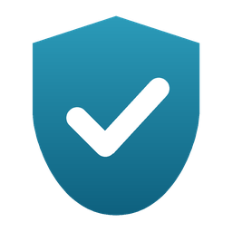

<div align="center">



# Bastion Antivirus

**A modern, open-source antivirus for Windows 11, without a kernel driver.**

Real-time file protection · RAT & network detection · ransomware decoys · encrypted quarantine · Fluent glass UI

[](https://github.com/lspx-1/AV/actions/workflows/build.yml)


</div>

> [!WARNING]
> Bastion is a hobby and learning project. It does **not** replace Microsoft Defender, Bitdefender or any
> other professional antivirus. Keep your main antivirus enabled and run Bastion alongside it.

---

## Features

| | |
|---|---|
| 🛡️ **Real-time file guard** | Scans new and changed files in Downloads, Desktop, Temp and AppData within moments. |
| 🔍 **Scanner** | Quick, full and custom scans with SHA-256 signatures, YARA-compatible rules and heuristics. |
| 🧠 **Heuristics** | Fake extensions (`Rechnung.pdf.exe`), hidden RTLO characters, packers, encrypted code, process-injection and keylogger APIs, unsigned programs in user folders. |
| 🌐 **Network & RAT detection** | Live view of every connection with its program. Flags known command servers, *beaconing* (regular check-ins typical for remote-access trojans), hidden listeners, disguised system processes and script hosts going online. Block addresses or programs in Windows Firewall with one click. |
| ⚙️ **Process guard** | Checks every new process and catches programs disguised as `svchost.exe` & co. |
| 🚀 **Autostart guard** | Reports new Run keys, startup folder entries and scheduled tasks, and removes them on request. |
| 🧀 **Ransomware decoys** | Hidden bait files in Documents, Pictures and Desktop. If something encrypts them, Bastion sounds the alarm and stops suspicious new programs. |
| 📄 **Hosts file guard** | Detects redirects of banks, Windows Update and security vendors, and restores a clean copy. |
| 🔒 **Encrypted quarantine** | AES-256-GCM, key protected with DPAPI. Quarantined files can't run or trigger other scanners. |
| 🤝 **Plays nice with others** | Detects Bitdefender, ESET, Kaspersky … via Windows Security Center and switches to *complementary mode* (no duplicate on-access scans). |
| 🔄 **Threat feeds** | Downloads [MalwareBazaar](https://bazaar.abuse.ch/) hashes and [Feodo Tracker](https://feodotracker.abuse.ch/) C2 IPs. |
| 🔑 **Licensing** | Free/Pro with signed license keys, online activation & deactivation, offline license files, KeyGen tool. |
| ✨ **Glass UI** | Windows 11 Fluent design with Acrylic/Mica, light & dark theme, tray icon, toast notifications, Explorer context menu. |

## Design

The interface follows a *Glass + Minimal* direction: a translucent window, one big status in the middle and quiet lists instead of a wall of cards.
An interactive HTML mockup lives in [`docs/design/mockup.html`](docs/design/mockup.html).

| Status | Network |
|---|---|
| Big status orb with breathing glow, quick and full scan, protection modules with toggles, recent events | Every connection with program, signature state and risk; kill, block address, block program |

## Installation

1. Download the latest `Bastion-…-win-x64.zip` from [Releases](https://github.com/lspx-1/AV/releases) or the newest build artifact from [Actions](https://github.com/lspx-1/AV/actions).
2. Unpack it, open **PowerShell as administrator** in that folder and run:

   ```powershell
   powershell -ExecutionPolicy Bypass -File .\install.ps1
   ```

   This copies Bastion to `C:\Program Files\Bastion`, registers and starts the **Bastion service** (real-time protection with admin rights) and adds the tray app to autostart.
3. To remove it: `.\uninstall.ps1` (add `-RemoveData` to also delete quarantine and settings).

**Without installing:** just start `Bastion.exe`. It runs in *app mode*: protection is active while the app (or its tray icon) runs, with the rights of your user account.

### Test it

Bastion detects the harmless [EICAR test file](https://www.eicar.org/download-anti-malware-testfile/). Save it into your Downloads folder and watch it move into quarantine.
(Your other antivirus will probably catch it too.)

### Bitdefender & other antivirus products

Bastion runs next to them. If Bitdefender flags Bastion's own folders (signature files contain malware patterns), add exclusions for
`C:\Program Files\Bastion` and `C:\ProgramData\Bastion` in Bitdefender → *Protection → Antivirus → Settings → Manage exceptions*.

## Building

Requirements: Windows 10/11, [.NET 10 SDK](https://dotnet.microsoft.com/download).

```powershell
git clone https://github.com/lspx-1/AV.git
cd AV
dotnet build Bastion.sln
dotnet test tests/Bastion.Core.Tests
dotnet run --project src/Bastion.App          # app mode, no install needed
```

`Bastion.Core`, the KeyGen tool and the tests also build on Linux and macOS; the WPF app and the service need Windows.

## Licensing

Bastion is MIT-licensed open source. **Pro** unlocks comfort features (scheduled scans, own rules, hourly updates) and supports the project. Protection is the same in Free and Pro.

### Bastion License Manager

The easiest way: download `Bastion-LicenseManager-…-win-x64.zip` from the release, unpack it and start `BastionLicenseManager.exe`.

1. **Schlüssel** → *Neuen Schlüssel erstellen* (or *Vorhandenen importieren* if you already have `keys/license-private.pem` from the KeyGen CLI).
2. *Sicherung exportieren* and keep that file offline. It is your **private** key: never share or commit it. Without it you cannot issue licenses anymore.
3. *In Bastion auf diesem PC installieren* (asks for admin rights). This copies the **public** key into `C:\Program Files\Bastion` and restarts Bastion. Do this on every PC that should accept your licenses, or run
   `setup-licensing.ps1 -PublicKey license-public-key.pem` as administrator there.
4. **Lizenz ausstellen**: enter a name, devices and duration → you get a key like `BSTN-7Q4M-2D9K-P1XA-K2XR` and a `.bastionlic` file.
   In Bastion: *Lizenz → Lizenzdatei importieren*.

All issued licenses are listed under **Ausgestellt** (search, save the file again, renew for a year).

### Command line (KeyGen)

```bash
dotnet run --project tools/Bastion.KeyGen -- init      # key pair; also writes the public key into Bastion.Core
dotnet run --project tools/Bastion.KeyGen -- issue --name "Max Muster" --email max@example.com --seats 3 --days 365
```

`init` writes `keys/license-private.pem` (git-ignored) and `src/Bastion.Core/Licensing/license-public-key.pem`. If you commit the public key, it is built into every release and no installation step is needed.

### License server

Online activation, validation and deactivation are optional. Enter the server URL in *Einstellungen → Erweitert*. The API the server needs to implement is documented in **[docs/licensing-api.md](docs/licensing-api.md)**.
Online licenses keep working for 30 days without a connection.

## Project structure

```
src/Bastion.Core/      scanner, detectors, protection modules, quarantine, licensing, IPC
src/Bastion.Service/   Windows service hosting the engine (LocalSystem)
src/Bastion.App/       WPF app (WPF-UI), tray icon, notifications
tools/Bastion.KeyGen/  license key CLI
tools/Bastion.LicenseManager/  license manager app (create keys, issue and track licenses)
tests/                 xUnit tests
signatures/            shipped hashes, rules and IP lists
scripts/               install.ps1 / uninstall.ps1 / setup-licensing.ps1
docs/                  architecture, licensing API, rule syntax, design mockup
```

More details: [docs/architecture.md](docs/architecture.md) · [docs/rules.md](docs/rules.md)

## What Bastion can't do (by design)

Without a kernel driver, which needs Microsoft's driver signing, Bastion

* scans files right **after** they are written instead of blocking them **before** they are opened,
* can't register as the system antivirus in Windows Security Center, so it runs alongside your main antivirus,
* has no tamper protection beyond Windows file permissions: an administrator can stop the service.

## Roadmap

- [ ] Native YARA integration (regex, modules)
- [ ] AMSI provider for script scanning (PowerShell, VBScript)
- [ ] ETW-based process and file telemetry
- [ ] English UI
- [x] License manager app
- [ ] License server
- [ ] MSI installer

## Contributing

Issues and pull requests are welcome. Please run `dotnet test` before opening a PR. If you find a way to bypass a detection, open an issue. If you found a security vulnerability in Bastion itself, please report it privately via GitHub Security Advisories.

## License

[MIT](LICENSE) © 2026 lspx-1
