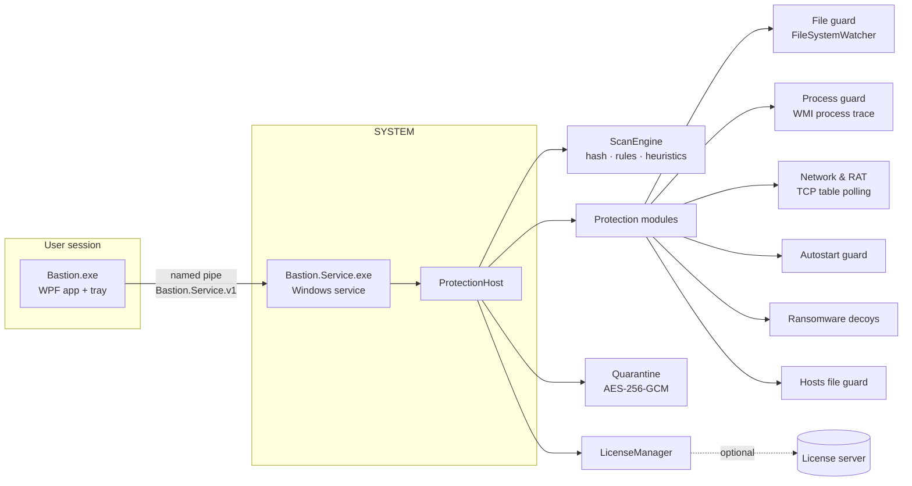

# Architecture

## Projects

| Project | Role |
|---|---|
| `src/Bastion.Core` | Everything that protects: scanner, detectors, modules, quarantine, licensing, IPC. Plain .NET 10, unit tested. |
| `src/Bastion.Service` | Thin Windows service that hosts `ProtectionHost` and the pipe server. Runs as LocalSystem. |
| `src/Bastion.App` | WPF UI with [WPF-UI](https://github.com/lepoco/wpfui) (Fluent design, Mica/Acrylic). |
| `tools/Bastion.KeyGen` | CLI to create the license key pair and issue license files. |
| `tests/Bastion.Core.Tests` | xUnit tests for the core. |

## Service mode and app mode

The app first tries to connect to the service. If the service is not installed it starts its own
`ProtectionHost` in-process ("App-Modus"). Protection then runs only while the app (or its tray icon)
runs and without admin rights: the process guard falls back to polling and firewall actions are unavailable.

## Pipe security

The pipe allows authenticated users to connect, but the service checks the **image path of the client
process** (`GetNamedPipeClientProcessId` + `QueryFullProcessImageName`). Only executables from the
service's own install folder are served. That folder lies in `Program Files`, which only administrators
can write to, so malware running as the user cannot simply turn protection off through the pipe.
For development set the environment variable `BASTION_ALLOW_ANY_CLIENT=1` for the service.

## Detection pipeline

1. `FileScanContext` reads the file once (hash over the whole file, content up to 64 MB).
2. `HashDetector` checks the SHA-256 against the signature database.
3. `RuleDetector` evaluates the content rules.
4. `HeuristicDetector` scores traits (double extension, RTLO, packers, entropy, suspicious imports,
   unsigned in user folders). Signed files and files in `C:\Windows` skip the heuristics.
5. The most important detection becomes the verdict. Definitive hits (hash, high-severity rule) can be
   quarantined automatically; heuristic hits ask the user by default.

## Network & RAT detection

`NetworkMonitor` polls `GetExtendedTcpTable` every 3 seconds and maps connections to processes.
`RemoteAccessAnalyzer` flags:

* connections to known command-and-control IPs (abuse.ch Feodo Tracker, own lists),
* **beaconing**: an unsigned program or one from a user folder that reconnects to the same server in
  very regular intervals (≥ 6 connections, jitter ≤ 15 %),
* unsigned programs from user folders that listen on a public port (backdoors),
* programs named like Windows processes (`svchost`, `lsass`, …) running from another folder,
* script hosts (PowerShell, wscript, mshta …) talking to the internet,
* active remote-support tools (TeamViewer, AnyDesk, …) as information, because scammers misuse them.

Actions: end the process, quarantine its file, block the address or the program in Windows Firewall.

## Limits without a kernel driver

* Files are scanned right **after** they are written, not before they are opened. A minifilter driver
  would be needed to block access, and that requires Microsoft driver signing.
* Bastion cannot register as the system antivirus in Windows Security Center (that requires
  Microsoft's partner program and an ELAM driver). It runs **alongside** Defender, Bitdefender, etc.
* The service can be stopped by an administrator. There is no tamper protection beyond file ACLs.
